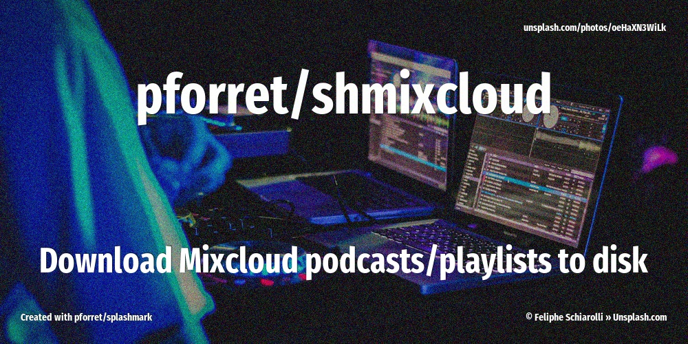

[](https://basher.gitparade.com/package/)

# shmixcloud



- Download Mixcloud shows to disk to be used in on USB stick in the car
- download N most recent shows (default: 10)
- add Title, Author, Album, Image to (M4A) audio file

## 🔥 Usage

```
Program: shmixcloud 1.0.1 by peter@forret.com
Updated: Jul  7 22:40:25 2021
Description: Download Mixcloud shows to disk to be used in e.g. car
Usage: shmixcloud [-h] [-q] [-v] [-f] [-l <log_dir>] [-t <tmp_dir>] [-o <out_dir>] [-x <max_dl>] <action> <url?>
Flags, options and parameters:
    -h|--help        : [flag] show usage [default: off]
    -q|--quiet       : [flag] no output [default: off]
    -v|--verbose     : [flag] output more [default: off]
    -f|--force       : [flag] do not ask for confirmation (always yes) [default: off]
    -l|--log_dir <?> : [option] folder for log files   [default: /Users/pforret/log/shmixcloud]
    -t|--tmp_dir <?> : [option] folder for temp files  [default: /tmp/shmixcloud]
    -o|--out_dir <?> : [option] output folder for the m4a/mp3 files (default: derive from URL)
    -x|--max_dl <?>  : [option] maximum downloads from this playlist  [default: 10]
    <action>         : [parameter] action to perform: download/update/check
    <url>            : [parameter] Mixcloud URL of a user or a playlist (optional)
```

## ⚡️ Examples

```bash
$ shmixcloud download https://www.mixcloud.com/djsupermarkt_tooslowtd/
# files will be stored in ./djsupermarkt_tooslowtd/
$ shmixcloud -x 20 download https://www.mixcloud.com/DjBlasto/playlists/discosauro/
# files will be stored in ./DjBlasto/discosauro/
```

## 🚀 Installation

with [basher](https://github.com/basherpm/basher)

	$ basher install pforret/shmixcloud

or with `git`

	$ git clone https://github.com/pforret/shmixcloud.git
	$ cd shmixcloud

## 📝 Acknowledgements

* script created with [bashew](https://github.com/pforret/bashew)

&copy; 2021 Peter Forret
