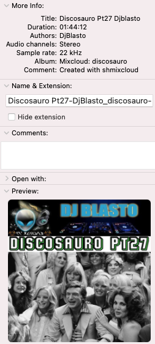

[](https://basher.gitparade.com/package/)

# shmixcloud


- Download MixCloud shows to disk to be used on USB stick for e.g. 🚗 (tested on BMW X1 😉)
- download N most recent shows (default: 10)
- add Title, Author, Album, Image to (M4A) audio file

## 🔥 Usage

```
Program: shmixcloud 3.1.0 by peter@forret.com
Updated: Mar  8 16:45:25 2025
Description: Download Mixcloud shows to disk to be used in e.g. car
Usage: shmixcloud [-h] [-q] [-v] [-f] [-f] [-Q] [-l <log_dir>] [-o <out_dir>] [-t <tmp_dir>] [-A <AUDIO>] [-C <COMMENT>] [-D <DAYS>] [-F <FONT>] [-G <FONTSIZE>] [-I <FILTER>] [-N <NUMBER>] [-P <PIXELS>] [-S <SUBTITLE>] [-T <TITLE>] <action> <url?>
Flags, options and parameters:
    -h|--help        : [flag] show usage [default: off]
    -q|--quiet       : [flag] no output [default: off]
    -v|--verbose     : [flag] output more [default: off]
    -f|--force       : [flag] do not ask for confirmation (always yes) [default: off]
    -f|--force       : [flag] do not ask for confirmation (always yes) [default: off]
    -Q|--qrcode      : [flag] add QR encode of URL to image [default: off]
    -l|--log_dir <?> : [option] folder for log files   [default: /Users/pforret/log/shmixcloud]
    -o|--out_dir <?> : [option] output folder for the m4a/mp3 files (default: derive from URL)
    -t|--tmp_dir <?> : [option] folder for temp files  [default: .tmp]
    -A|--AUDIO <?>   : [option] audio format to use  [default: m4a]
    -C|--COMMENT <?> : [option] comment metadata for audio file  [default: %c %a]
    -D|--DAYS <?>    : [option] maximum days to go back  [default: 365]
    -F|--FONT <?>    : [option] font to use for subtitle  [default: Helvetica]
    -G|--FONTSIZE <?>: [option] font size  [default: 32]
    -I|--FILTER <?>  : [option] only download matching mixes  [default: /]
    -N|--NUMBER <?>  : [option] maximum downloads from this playlist  [default: 10]
    -P|--PIXELS <?>  : [option] resolution image (width/height in pixels)  [default: 500]
    -S|--SUBTITLE <?>: [option] subtitle for the image  [default: %u @ %y]
    -T|--TITLE <?>   : [option] title metadata for audio file  [default: %d: %t (%mmin)]
    <action>         : [parameter] action to perform: download/update/check
    <url>            : [parameter] Mixcloud URL of a user or a playlist (optional)
```

## ⚡️ Examples

```bash
$ shmixcloud download https://www.mixcloud.com/djsupermarkt_tooslowtd/
# files will be stored in ./djsupermarkt_tooslowtd/
$ shmixcloud -N 20 download https://www.mixcloud.com/DjBlasto/playlists/discosauro/
# files will be stored in ./DjBlasto/discosauro/
```

File info (Apple+I) will look like this:\


## 🚀 Installation

with [basher](https://github.com/basherpm/basher)

	$ basher install pforret/shmixcloud

or with `git`

	$ git clone https://github.com/pforret/shmixcloud.git
	$ cd shmixcloud

## 📝 Acknowledgements

* script created with [bashew](https://github.com/pforret/bashew)

&copy; 2021 Peter Forret
